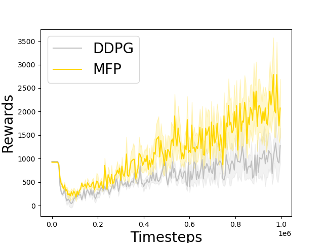

# _Markov_ flow policy.

## Usage
```
sh ./experiment.sh <Environment>
```

## Installation
```
Gym 0.23.1
MuJoCo 2.3.6
PyTorch 2.0.0
Python 3.10.9
```

## Policy
```
a = self.activ(self.l1(
    a.abs()
))
a = self.activ(self.l2(
    a.abs()
))
```

## Results

